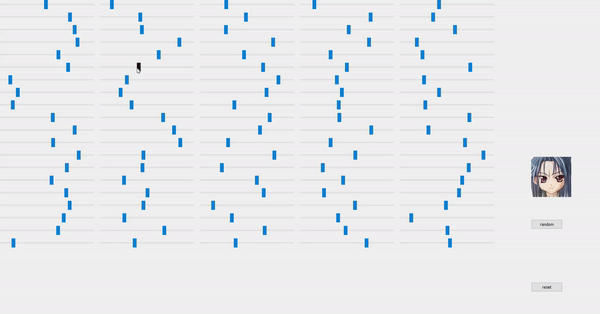
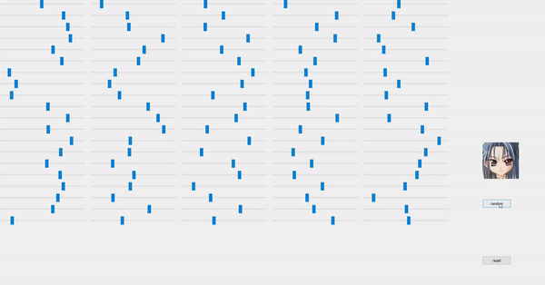

# GAN-Image-Generator
GUI Feature: 
The generator takes a vector of size 100 as input to produce an output image of size 128\*128. The 100 sliders corresponds to the 100 values. 
 
 
The "random" button once clicked will randomize all the sliders to produce a random image. 
 
 
This repository uses WGAN to generate 128\*128 images. I use it to generate anime faces, but it can be used to generate any image if trained using proper datasets. 
I used the dataset on https://www.kaggle.com/splcher/animefacedataset and wrote delete_duplicate.py to delete duplicated images found in the dataset. 
Images after 1 epoch: 

 
Images after 2 epoch: 

 
Images after 12 epoch: 

 
Images after 23 epoch: 

 
Images after 130 epoch: 

 
Images after 161 epoch: 

 
